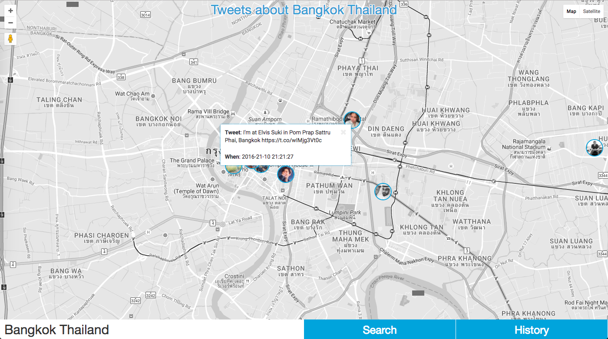

# Preview



# Preparation
To set everything up and running you need to have docker installed on your system
```
# Minimum requirements
$ docker -v
Docker version 1.12.3, build 6b644ec, experimental

$ docker-compose -v
docker-compose version 1.9.0-rc4, build 181a4e9
```

# Host file (/etc/hosts)
```
0.0.0.0 dev.tweets-location.mahanhazrati.com
```

# Running (Docker-compose)
```
# Run the docker images (debug mode)
$ make docker-up

# Run the docker images (background)
$ make docker-start

# Run the docker images (background/rebuild)
$ make docker-build
```

# Install 
To install the app you just need to use the following commands:
```
# To install dependencies
$ make install

# To run the mysql and phpmyadmin on docker
$ make mysql

# To start serving the app with on local environment 
$ make run-local

# To start serving the app with on production environment 
$ make run-prod

# To run the ngrok proxy
$ make proxy

# To run the webpack for local
$ make webpack-local

# To run the webpack for production
$ make webpack-prod

# To Run Migration on docker compose
docker-migration
```
## Support on Beerpay
Hey dude! Help me out for a couple of :beers:!

[](https://beerpay.io/mahanhaz/tweets-location)  [](https://beerpay.io/mahanhaz/tweets-location?focus=wish)